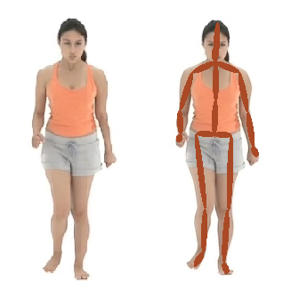
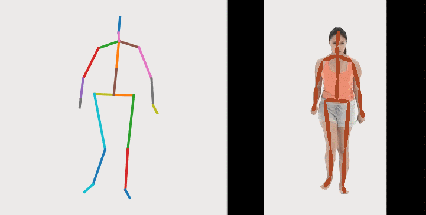

# VNect

An tensorflow implementation of [VNect: Real-time 3D Human Pose Estimation with a Single RGB Camera](http://gvv.mpi-inf.mpg.de/projects/VNect/).

|     |
| --------------------------------------- |
|  |

For the caffe model: please contact the author of the paper.

## Environments

- Windows 10 Pro
- Python 3.5.6 (64 bit)
- opencv-python 3.4.4.19
- tensorflow-gpu 1.12.0
- [pycaffe](https://github.com/BVLC/caffe/tree/windows)

## Usage

1. Drop the caffe model into `models/caffe_model`.
2. Run caffe_model_data.py to get the model weights.
3. Run vnect_model.py to generate tensorflow model (graph and weights).
4. Run benchmark.py to test video: 
   1. click the left mouse button to confirm a simple static bounding box generated by HOG method, then the results are shown;
   2. trigger any keyboard input to exit at any time.
5. Run test_pic.py to test image: the outputs are 4×21 heatmaps and 2D results.

## Notes

1. The input image is in BGR color format and regulated into a range of [-0.4, 0.6).
2. Every input image is assumed to contain 21 joints to be found, which means it is easy to fit wrong results when a joint is actually not in the input.
3. The results of the model in this implementation are not as good as the results shown in the video provided by the author, especially when predicting unusual postures (e.g. sitting on the ground).

## TODO

1. Optimize the structure of the codes.
2. Implement a better bounding box strategy.
3. Add a coordinate filter to smooth the results.
4. Figure out the reason why **matplotlib 3.0.2** is likely to be stuck.

## Reference Repositories

- original MATLAB implementation provided by the model author
- [timctho/VNect-tensorflow](https://github.com/timctho/VNect-tensorflow)
- [EJShim/vnect_estimator](https://github.com/EJShim/vnect_estimator)